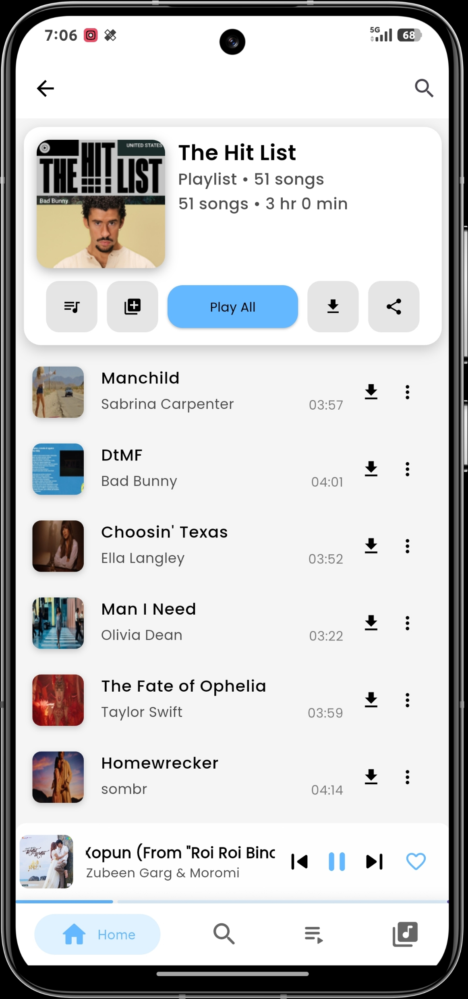
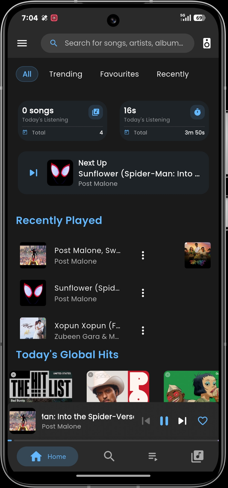

# Noize

<div align="center">
  
  
  <h1>Noize</h1>
  
  <p>
    Your ultimate groove companion – a powerful, privacy‑first YouTube Music experience.
  </p>
  
  <!-- Badges -->
  <p>
    <a href="https://github.com/anandssm/noize/releases/latest">
      
    </a>
    <a href="https://github.com/anandssm/noize/releases">
      
    </a>
    <a href="https://github.com/anandssm/noize/blob/main/LICENSE">
      
    </a>
    <a href="https://github.com/anandssm/noize/actions/workflows/build-release.yml">
        
    </a>
  </p>

  [Website](https://noizeapp.netlify.app/) | [Download](https://noizeapp.netlify.app/)
  
  
  **Contact & Support:**
  - Email: [gravityappslabin@gmail.com](mailto:gravityappslabin@gmail.com)
  - Support group: [Telegram](https://t.me/noizesupport)
  - Updates channel: [Telegram](https://t.me/NoizeUpdates)

</div>

> **⚠️ Work in Progress:** Noize is currently under active development. Features may be incomplete, unstable, or subject to change.

## 🎵 About Noize

Noize is a free and open source YouTube Music client for Android, Windows, and Linux. Built with Flutter, it focuses on smooth playback, rich customization, and privacy-first local data control. iOS and macOS support is coming soon.

### At a Glance

- Stream from YouTube Music, with optional JioSaavn support.
- Download tracks/playlists for offline listening.
- Use synced lyrics (YouTube Music / LRCLib / AI providers).
- Manage local music folders and file extensions.
- Enjoy built-in equalizer, sleep timer, and playback stats.

## 📸 Screenshots


| Light Mode | Dark Mode |
|---|---|
|  |  |


## ✨ Features

Noize includes a wide set of features implemented in this repository:

### Streaming & Discovery

- Stream songs, albums, artists, playlists, and videos from YouTube Music.
- Optional JioSaavn integration for alternate/high-quality source.
- Country-aware Trending feed.
- Home sections for recently played, liked songs, favorite artists, and recent playlists.

### Search & Navigation

- Fast search with suggestions.
- Search history with enable/disable controls and clear actions.
- Grouped results by Songs, Albums, Artists, Playlists, and Videos.
- In-list search delegates for library and playlist/album screens.

### Playback Experience

- Background playback with media session integration.
- Queue management: add to queue, play next, reorder queue, clear queue.
- Playback controls: shuffle, repeat, speed, volume.
- Video mode support for playable YouTube video content.
- Windows SMTC integration and Android media notifications.

### Downloads & Offline

- Download individual songs or complete playlists.
- Concurrent download queue with progress/preparing states.
- Configurable download quality.
- Embedded metadata/artwork handling for downloaded content.
- Dedicated downloads screen for offline playback.

### Local Library

- Scan local audio files and play from device storage.
- Manage included/excluded folders.
- Manage included/excluded file extensions.
- Minimum duration filters and local permission handling flow.
- Import local tracks into active playback queue.

### Lyrics

- Multiple lyric providers: YouTube Music, LRCLib, AI.
- AI lyric generation via Gemini/OpenAI (API key configurable).
- Supports synchronized and plain lyrics.
- Seek to lyric lines while playback is running.
- Caching support for faster lyric access.

### Playlists, Favorites & Library Data

- Create, delete, and manage custom playlists.
- Add/remove songs to playlists from option sheets.
- Liked songs and favorite artists management.
- Saved playlists/albums and created playlists sections.

### Audio Controls

- Built-in equalizer screen.
- Presets and custom tuning controls.
- Streaming quality and downloading quality settings.
- Audio output selection support.

### Smart Utilities

- Sleep timer with optional fade-out effect.
- Playback statistics (daily/weekly/monthly views, top artists).
- Crash log viewer with share/clear controls.
- Connectivity status handling and graceful fallback.

### OTA Updates & Channels

- In-app update checking.
- Update channels (stable/beta/dev).
- Version-based update detection.
- Release notes, update progress, ETA, and install flow.

### Customization & Accessibility

- Light, Dark, and System theme modes.
- Adaptive/dynamic accent color and manual accent color picker.
- Full-player background animation selection (multiple styles + static).
- Multi-language support (English, Hindi, Spanish, French, German, Russian, Ukrainian, Bengali, Japanese, Chinese, Urdu, Telugu, Tamil, Marathi).

### Data & Settings Tools

- Export/import settings and app data selections.
- Granular clear actions (cache, playback stats, queues, logs, playlists, favorites, etc.).
- AI provider and key management screen.
- Language selection and general app preferences.

### Sharing & Integrations

- Share song links and app links.
- Android share-intent support for incoming local files.
- Open tracks externally (YouTube / YouTube Music).

Quick tips:
- Download a song from its options menu or from a playlist menu.
- Enable AI lyrics in **Settings → AI API Configuration**.
- Open equalizer in **Settings → Audio Settings → Equalizer**.

Supported audio formats: `.mp3`, `.aac`,`.m4a`, `.wav`, `.flac`, `.ogg`.

## 💻 Tech Stack

Noize is built with Flutter and community packages. Core stack overview:

| Area | Libraries / Tools | Purpose |
|---|---|---|
| Framework | Flutter, Dart | Cross-platform app UI and business logic |
| State & DI | provider, get_it, go_router | State management, dependency injection, navigation |
| Audio Engine | just_audio, just_audio_background, just_audio_media_kit, audio_service, audio_session, audioplayers | Playback, background controls, media session integration |
| Streaming & Video | dart_ytmusic_api, youtube_explode_dart (git fork), youtube_player_flutter, flutter_inappwebview, jiosaavn | Streaming metadata, stream extraction, embedded player, alternate source |
| Downloads & Network | dio, flutter_local_notifications | Download pipeline and user notifications |
| Local Media & Metadata | metadata_god, audio_metadata_reader| Local song discovery, tags/artwork extraction, output device controls |
| Storage | hive_ce, shared_preferences, path_provider | App data persistence and local storage paths |
| UI & Visualization | easy_localization, google_fonts, dynamic_color, palette_generator, flutter_animate, fl_chart, cached_network_image, shimmer, flutter_svg, persistent_bottom_nav_bar_v2 | Localization, visuals, animation, charts, and UI components |
| Platform Integrations | receive_sharing_intent (git), smtc_windows, android_intent_plus, package_info_plus, device_info_plus, connectivity_plus, permission_handler, file_picker, terminate_restart | Intents, platform controls, permissions, file picking, restart/update helpers |
| Utilities | share_plus, url_launcher, collection, crypto, synchronized, talker_flutter, audio_video_progress_bar | Sharing, links, helpers, logging, progress UI |

(See `pubspec.yaml` for a full list and exact versions.)

## 🚀 Installation

### Android

1.  Download the latest APK from the [website](https://noizeapp.netlify.app/).
2.  Enable "Install from unknown sources" in your device settings.
3.  Install the downloaded APK file.

### Windows

1.  Download the Windows installer from the [website](https://noizeapp.netlify.app/).
2.  Run the installer and follow the on-screen instructions.
3.  Launch Noize from the Start Menu.

### Linux

1.  Download the latest Linux build from the [website](https://noizeapp.netlify.app/).
2.  Extract the archive and run the Noize executable.
3.  Optionally, create a desktop entry for easy access.

### iOS & macOS

iOS and macOS support is currently under development and coming soon. Stay tuned for updates!

## 🛠️ Development

Interested in contributing to Noize? Here's how to get started:

### Prerequisites

-   [Flutter SDK](https://flutter.dev/docs/get-started/install)
-   [Android Studio](https://developer.android.com/studio) / [Visual Studio Code](https://code.visualstudio.com/)
-   For Windows development: [Visual Studio with C++ development tools](https://visualstudio.microsoft.com/downloads/)

### Setup

1.  **Clone the repository:**
    ```bash
    git clone https://github.com/anandssm/noize.git
    ```
2.  **Navigate to the project directory:**
    ```bash
    cd noize
    ```
3.  **Install dependencies:**
    ```bash
    flutter pub get
    ```
4.  **Run the app:**
    ```bash
    flutter run
    ```

### Project Structure

```
noize/
├── android/                     # Android build and platform code
│   └── app/                     # application module
├── build/                       # generated build artifacts (ignore)
├── docs/                        # documentation and release metadata
├── assets/
│   ├── images/                  # App images and artwork
│   └── translations/            # Localization JSON files
├── lib/
│   ├── core/                    # Shared services, providers, models, constants
│   ├── features/                # Feature‑first modules (player, search, settings, etc.)
│   ├── shared/                  # Shared widgets/components/animations
│   ├── generated/               # Generated files (hive, localization, etc.)
│   └── main.dart                # App entry point
├── linux/                       # Linux runner and CMake configuration
│   ├── CMakeLists.txt
│   ├── flutter/
│   └── runner/
├── windows/                     # Windows runner and packaging config
│   ├── CMakeLists.txt
│   ├── flutter/
│   └── runner/
├── test/                        # Widget/unit tests
└── pubspec.yaml                 # Dependencies and project metadata
```

## 🙌 Credits

This project stands on the work of many open-source maintainers and contributors. The full dependency list is maintained in `pubspec.yaml`, but the core packages that make Noize possible include:

- **Project & maintenance**: [Anand Kumar](https://github.com/anandssm) (lead developer & maintainer) and community contributors.
- **Framework**: [Flutter](https://flutter.dev/) and the Dart/Flutter ecosystem.

### Key dependency categories

- **Audio & playback** – just_audio, just_audio_background, just_audio_media_kit, audio_service, audio_session, audioplayers, sleek_circular_slider, smtc_windows
- **Streaming & metadata** – dart_ytmusic_api, youtube_explode_dart (custom fork), youtube_player_flutter, flutter_inappwebview, jiosaavn
- **Networking & downloads** – dio, connectivity_plus, flutter_local_notifications
- **Local media** – metadata_god, audio_metadata_reader
- **Storage & persistence** – hive_ce, shared_preferences, path_provider
- **Routing & state** – go_router, provider, get_it
- **UI & visuals** – easy_localization, google_fonts, dynamic_color, palette_generator, flutter_animate, fl_chart, cached_network_image, shimmer, flutter_svg, persistent_bottom_nav_bar_v2, pull_to_refresh, flutter_markdown_plus
- **Platform utilities** – android_intent_plus, android_package_installer, device_info_plus, duration_picker, file_picker, package_info_plus, permission_handler, receive_sharing_intent (git), share_plus, terminate_restart, url_launcher
- **General utilities** – async, collection, crypto, synchronized, talker_flutter, audio_video_progress_bar, cupertino_icons

### Development & packaging tools

- **Dev dependencies** – flutter_test, build_runner, flutter_lints, hive_ce_generator, msix
- **Packaging** – msix_config for Windows installer, custom Android Gradle scripts, CMake for desktop.

Thank you to everyone building and maintaining these open‑source libraries and tools – your work powers Noize.

## 🤝 Contributing

**Note:** This project is currently a work in progress. Pull requests are **not being accepted** at this time. Feel free to open issues for bug reports or suggestions, but please hold off on submitting PRs until further notice.

## 📝 License

This project is licensed under the GNU General Public License v3 (GPL‑3.0). See the `LICENSE` file for details.

## 🙏 Acknowledgments

-   Built with [Flutter](https://flutter.dev/)
-   Inspired by the need for a privacy-first, customizable YouTube Music client.

## ⚠️ Disclaimer

Noize is an unofficial client and is not affiliated with YouTube or Google in any way. It is intended for educational and personal use only.
